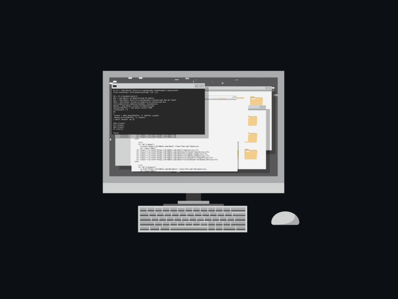

<h1 align="center">👋 Merhaba, ben Hüseyin Can Yılmaz </h1>

🔐 Cybersecurity Engineer | 🛡️ SOC Operations & Network Defense | 🌐 Infrastructure Security | 💻 Linux | ⚙️ Security Automation

---

  

---

## 🇹🇷 Hakkımda

Merhaba! Ben Hüseyin Can Yılmaz.  
**Bilgisayar Mühendisliği** mezunuyum (%100 İngilizce eğitim).  
Kurumsal ağ savunması ve güvenlik operasyonları (SOC) konularında uzmanlaşıyorum. **Turkcell**, **Efesan Group** ve **Ld Yazılım** bünyesindeki deneyimlerimle; **ArcSight SIEM** ile olay izleme, **Arbor/A10** platformlarında **DDoS mitigasyonu** ve **FortiGate** üzerinde yüksek erişilebilirlikli (HA) ağ mimarileri tasarımı konularında derinlik kazandım. Hem saldırı (Red Team) hem de savunma (Blue Team) perspektiflerini birleştirerek güvenli altyapılar inşa ediyorum.

---

## 🇬🇧 About Me

Hi there! I’m **Hüseyin Can Yılmaz**, a **Computer Engineering graduate** (100% English-taught program).  
I specialize in **Enterprise Network Defense** and **Security Operations (SOC)**. My professional background includes managing security events with **ArcSight SIEM**, mitigating **DDoS attacks** on **Arbor/A10** platforms, and designing resilient network infrastructures using **FortiGate (HA)**. I bridge offensive and defensive security practices to strengthen and harden large-scale enterprise environments.

---

## 🧩 Deneyim Alanlarım (Key Expertise)

- **SOC Operations & Monitoring:** ArcSight SIEM ile gerçek zamanlı olay izleme, analiz ve tehdit tespiti.
- **DDoS Mitigation:** Arbor ve A10 platformları üzerinden ağ trafiği analizi ve anomali engelleme.
- **Network Architecture:** FortiGate firewall üzerinde PNETLab ortamında HA (Active-Passive) clustering, VLAN segmentasyonu ve IPSec VPN yapılandırmaları.
- **Vulnerability Management:** Tenable Nessus ve OpenVAS ile zafiyet taraması ve raporlaması.
- **Perimeter Hardening:** Özel IPS imzaları geliştirme, FortiGuard Web Filtering ve Uygulama Kontrol politikaları optimizasyonu.

---

## 🧰 Tools & Technologies

### 🔐 Security & Monitoring
 
 
 

### 🌐 Networking & Defense
 
 
 
 

### 💻 Operating Systems & Tools
 
 
 

### 🛠 Programming & Languages
 
 
 

---

## 📜 Certifications
- **Cisco Networking Academy:** Professional Cybersecurity Pathway (Ethical Hacking, Network Defense, Endpoint Security)
- **Cisco Networking Academy:** Linux Essentials, Networking Basics, and IT Essentials
- **StationX:** The Complete Cyber Security Specialist

---

## 📊 GitHub Statistics

  
  

---

## ⚡ Fun Quote

  <i>“Bridging offensive and defensive security through continuous learning.”</i>
   
  <strong>"H. Can YILMAZ"</strong>

  

